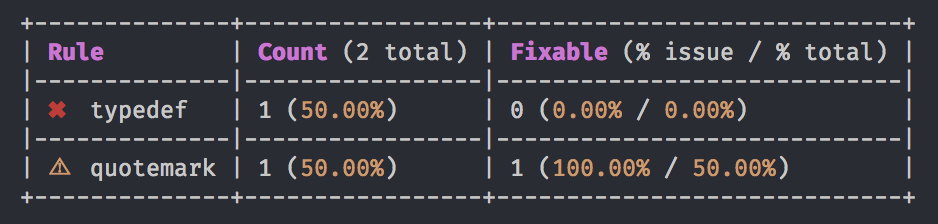

# TSLint totals formatter

A TSLint formatter that displays short overview of lint issues' scale in your project.



## Installation

`npm install tslint-totals-formatter`

or

`yarn add tslint-totals-formatter`

## Usage

From command line:

```
tslint -c tslint.json --project tsconfig.json -s node_modules/tslint-totals-formatter/formatters -t totals
```

From `npm scripts`:
```
{
  "lint:totals": "tslint -c tslint.json --project tsconfig.json -s node_modules/tslint-totals-formatter/formatters -t totals"
}
```


