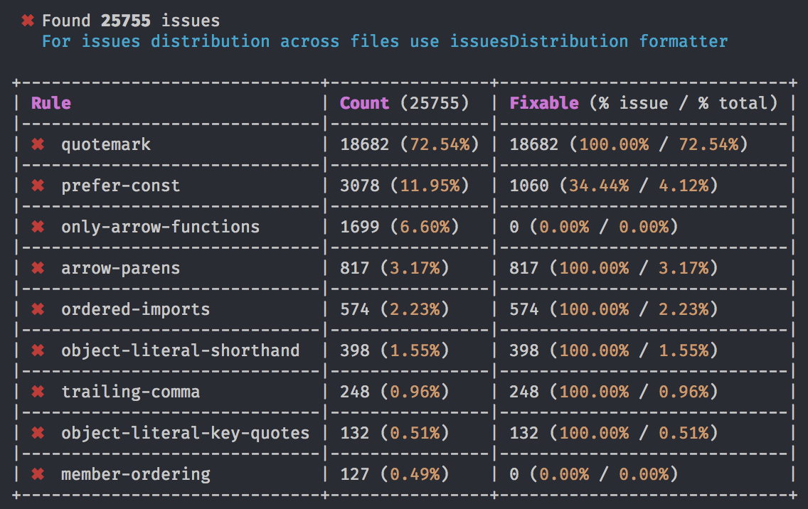
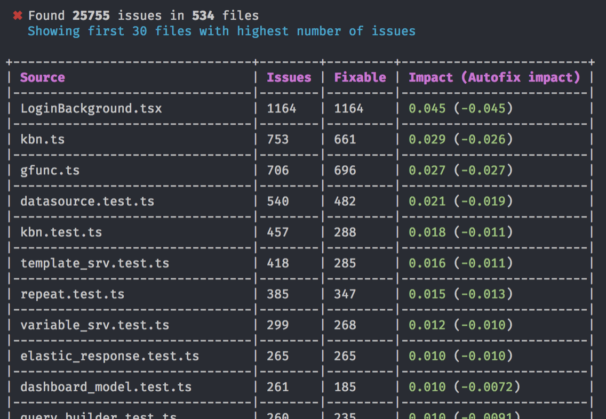

# TSLint totals formatter

A TSLint formatters that displays short overview of lint problems' scale in your project.

## Formatters

### Totals formatter


Shows issues overview *grouped by rule*. Includes information about the amount of autofixable issues and percentege of each issue type occurence.

### Distribution formatter



Shows top 30 files with the highest number of lint issues. Includes information about the amount of autofixable issues and total impact of fixing/autofixing issues per file.

## Installation

`npm install tslint-totals-formatter`

or

`yarn add tslint-totals-formatter`

## Usage

From command line:

```
tslint -c tslint.json --project tsconfig.json -s node_modules/tslint-totals-formatter/formatters -t totals
```

From `npm scripts`:
```
{
  "lint:totals": "tslint -c tslint.json --project tsconfig.json -s node_modules/tslint-totals-formatter/formatters -t totals"
}
```


